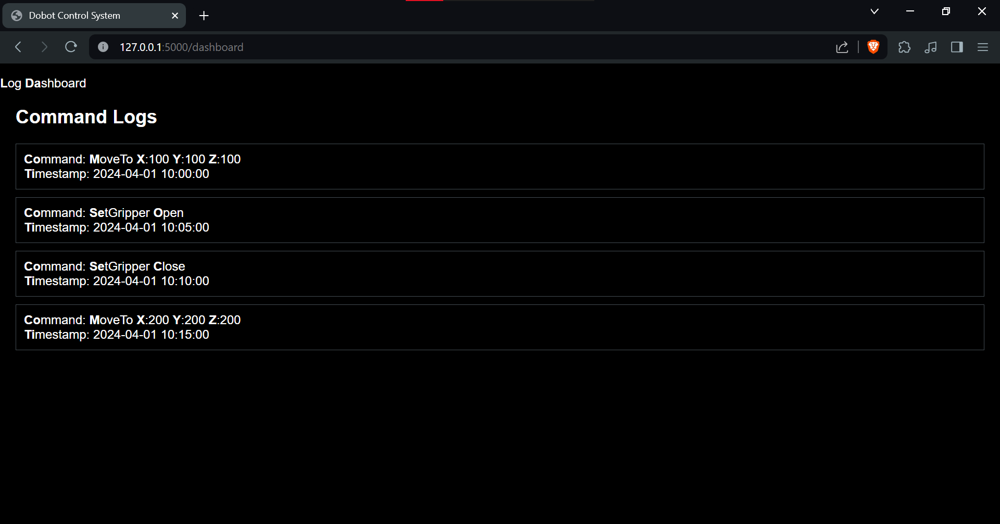
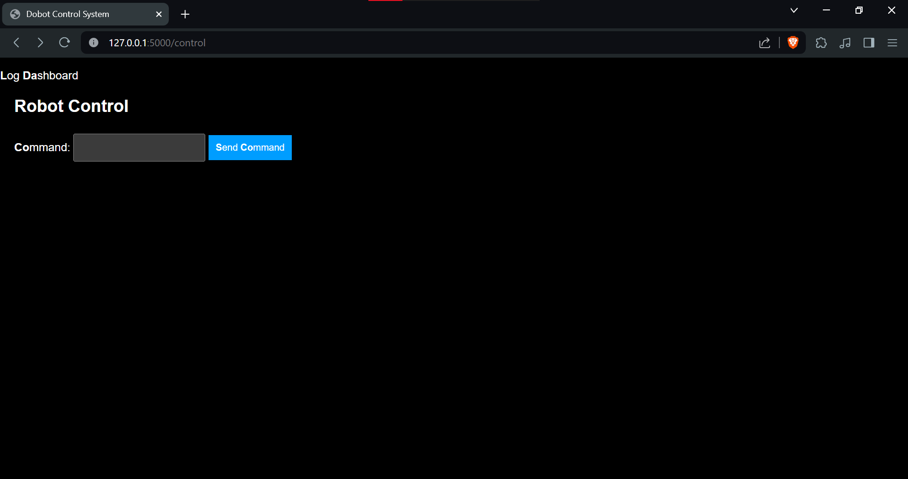

# Dobot Control System

This system provides a web interface for controlling a Dobot robot and viewing a log of commands sent to it. It uses Flask for the backend, HTMX for dynamic content on the frontend, and TinyDB as the database for storing command logs.

## Features

- **Dashboard**: View a log of all commands sent to the Dobot.
- **Robot Control**: Send commands to the Dobot when it's connected. The interface for sending commands will only be available if the application detects a Dobot connection.

## Setup

1. Ensure Python 3.8 or newer is installed on your system.
2. Clone this repository to your local machine.
3. Install the required Python packages by running `pip install -r requirements.txt` in the project root directory.
4. You may need to install and configure the Dobot SDK or API according to the Dobot documentation.

## Running the Application

1. Navigate to the project root directory in your terminal.
2. Run the Flask application with `python -m flask run`.
3. Open a web browser and go to `http://127.0.0.1:5000/` to access the web interface.

If the robot is _not_ connected, you will be able to access only the Log Dashboard page. It should look something like this:

If the robot _is_ connected, you will also be able to access the Robot Control page. It should look something like this:

## Using the Robot Control Page

The Robot Control page allows you to send commands to the Dobot robot directly from the web interface. To ensure successful command execution, follow the format guidelines for each command type:

### Move Command

To move the Dobot to a specific position, use the command format `move,x,y,z,r`, where `x`, `y`, `z`, and `r` are the target coordinates and rotation angle, respectively. For example:

- **Command:** `move,200,0,50,0` - Moves the Dobot to position `(200, 0, 50)` with a rotation angle of `0`.

### Home Command

To send the Dobot back to its home position, use the command `home`. This command does not require any additional parameters.

- **Command:** `home`

### Gripper Command

To control the Dobot's gripper, use the command format `gripper,on` or `gripper,off` to open or close the gripper, respectively.

- **Commands:**
  - `gripper,on` - Activates (closes) the gripper.
  - `gripper,off` - Deactivates (opens) the gripper.

### Speed Command

To set the movement speed of the Dobot, use the command format `speed,velocity,acceleration`, where `velocity` is the movement speed and `acceleration` is the acceleration rate.

- **Command:** `speed,100,100` - Sets the Dobot's movement speed to `100` and acceleration to `100`.

### Sending Commands

1. Navigate to the Robot Control page on the web interface.
2. Enter your command in the provided text input field according to the formats mentioned above.
3. Click the "Send Command" button to execute the command on the Dobot.

The system will log all commands sent, and you can view these logs on the Dashboard page to track the history of commands issued to the Dobot.